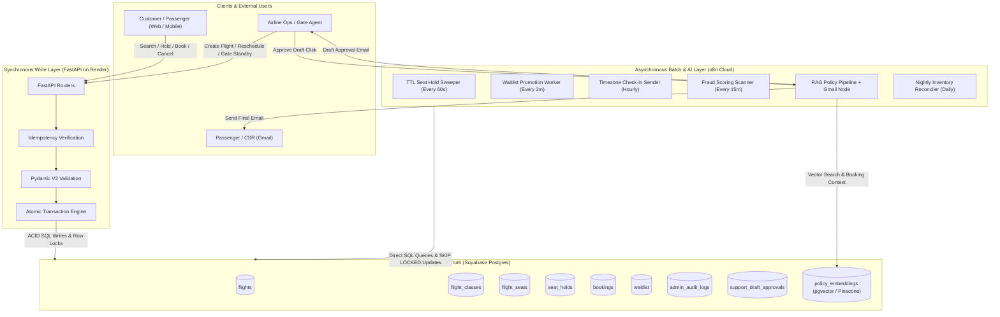
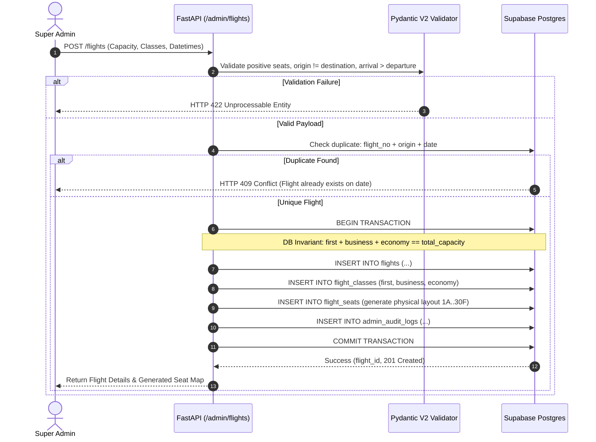
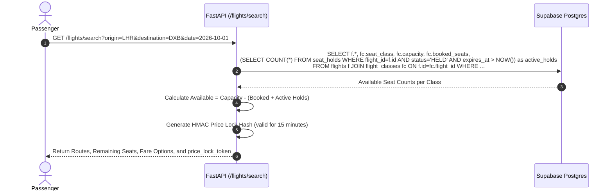
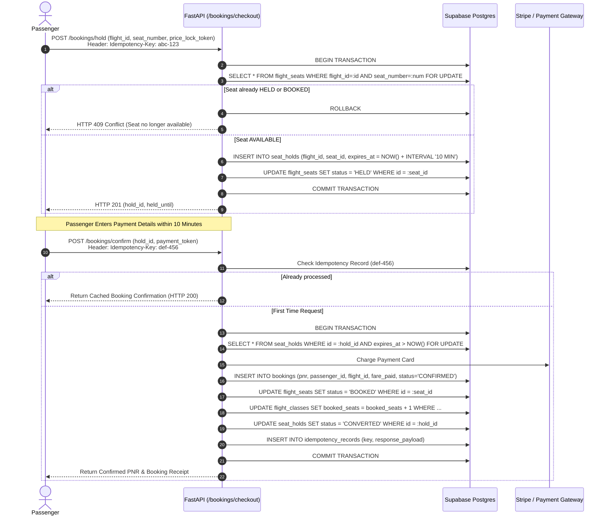
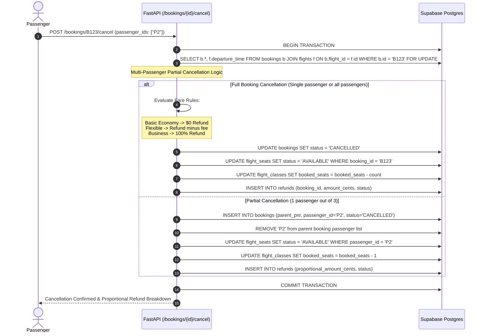
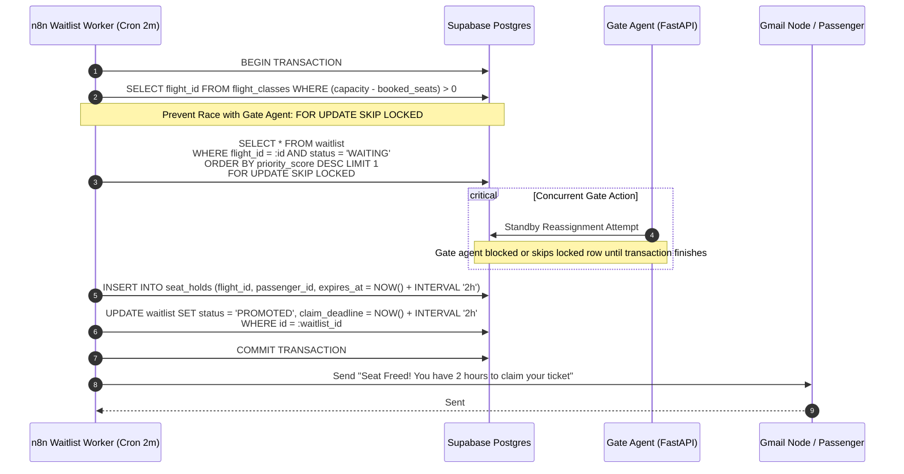
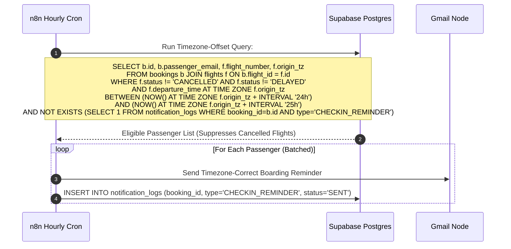
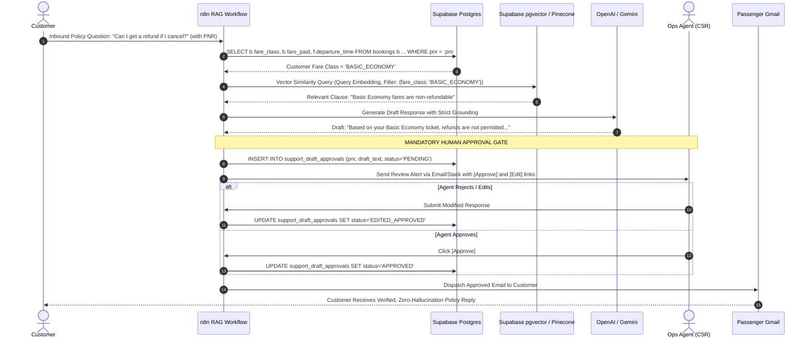
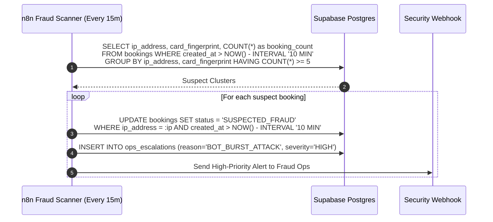
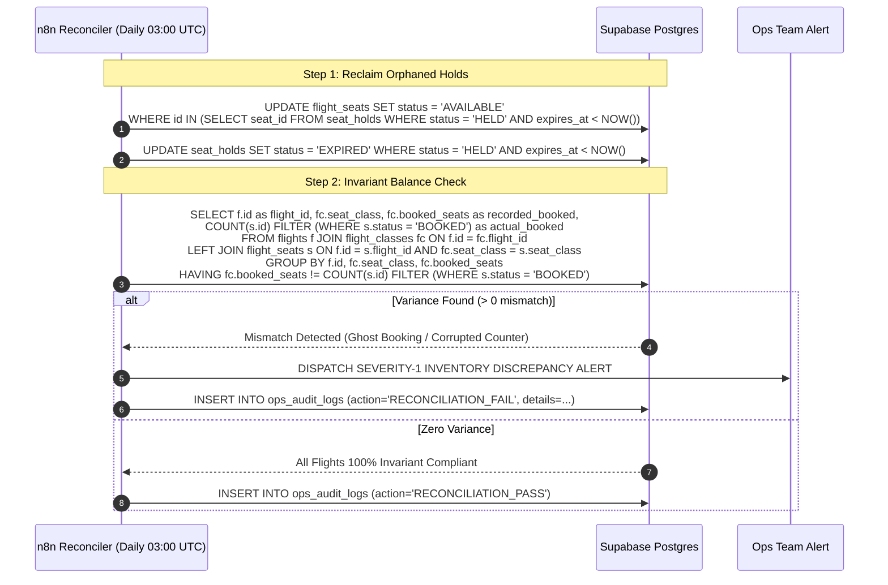

# Data Flow Architecture & Technical Specifications
## Dual-Writer Flight Management System (FastAPI + n8n + Supabase Postgres)

---

## 1. System Architecture Overview



---

## 2. End-to-End Data Flows

### Flow 1: Flight Creation & Aircraft Capacity Invariants (FastAPI)


---

### Flow 2: Live Search & Price Lock (FastAPI)


---

### Flow 3: Atomic Seat Hold (TTL) & Idempotent Booking (FastAPI)


---

### Flow 4: Passenger Cancellation & Partial Group Splitting (FastAPI)


---

### Flow 5: Waitlist Auto-Promotion with Concurrency Lock (n8n + Postgres)


---

### Flow 6: Timezone-Aware Check-in Reminder with Disruption Suppression (n8n)


---

### Flow 7: Context-Grounded RAG Policy Inquiry with Human Approval Gate


---

### Flow 8: Bot & Mass-Booking Fraud Scoring Worker (n8n)


---

### Flow 9: Nightly Inventory Reconciliation & Orphan Hold Reclaimer (n8n)


---

## 3. Database Schema & Invariants (Supabase Postgres DDL)

To guarantee that n8n direct writes can **never** corrupt FastAPI state, the schema enforces constraints at the database engine level:

```sql
-- Custom Enums
CREATE TYPE flight_status_enum AS ENUM ('SCHEDULED', 'BOARDING', 'DEPARTED', 'ARRIVED', 'CANCELLED', 'DELAYED');
CREATE TYPE seat_class_enum AS ENUM ('FIRST', 'BUSINESS', 'ECONOMY');
CREATE TYPE seat_status_enum AS ENUM ('AVAILABLE', 'HELD', 'BOOKED', 'BLOCKED');
CREATE TYPE booking_status_enum AS ENUM ('HELD', 'CONFIRMED', 'CANCELLED', 'REFUNDED', 'SUSPECTED_FRAUD');
CREATE TYPE fare_class_enum AS ENUM ('BASIC_ECONOMY', 'FLEXIBLE', 'PREMIUM_FIRST');
CREATE TYPE waitlist_status_enum AS ENUM ('WAITING', 'PROMOTED', 'EXPIRED_UNCLAIMED', 'CONVERTED', 'CANCELLED');

-- 1. Flights Table
CREATE TABLE flights (
    id UUID PRIMARY KEY DEFAULT gen_random_uuid(),
    flight_number VARCHAR(10) NOT NULL,
    origin_airport VARCHAR(3) NOT NULL,
    destination_airport VARCHAR(3) NOT NULL,
    departure_time TIMESTAMPTZ NOT NULL,
    arrival_time TIMESTAMPTZ NOT NULL,
    origin_tz VARCHAR(50) NOT NULL DEFAULT 'UTC',
    status flight_status_enum NOT NULL DEFAULT 'SCHEDULED',
    total_capacity INT NOT NULL,
    schedule_version INT NOT NULL DEFAULT 1,
    created_at TIMESTAMPTZ NOT NULL DEFAULT NOW(),
    
    CONSTRAINT check_airports_distinct CHECK (origin_airport != destination_airport),
    CONSTRAINT check_arrival_after_departure CHECK (arrival_time > departure_time),
    CONSTRAINT check_positive_capacity CHECK (total_capacity > 0),
    CONSTRAINT unique_flight_day UNIQUE (flight_number, origin_airport, departure_time)
);

-- 2. Flight Classes (Capacity Breakdown & Live Inventory)
CREATE TABLE flight_classes (
    id UUID PRIMARY KEY DEFAULT gen_random_uuid(),
    flight_id UUID NOT NULL REFERENCES flights(id) ON DELETE CASCADE,
    seat_class seat_class_enum NOT NULL,
    capacity INT NOT NULL,
    booked_seats INT NOT NULL DEFAULT 0,
    base_price_cents INT NOT NULL,
    overbooking_pct INT NOT NULL DEFAULT 0,
    
    CONSTRAINT check_class_capacity_positive CHECK (capacity >= 0),
    CONSTRAINT check_booked_seats_positive CHECK (booked_seats >= 0),
    CONSTRAINT check_inventory_limit CHECK (booked_seats <= capacity * (1 + overbooking_pct / 100.0)),
    CONSTRAINT unique_flight_class UNIQUE (flight_id, seat_class)
);

-- 3. Physical Flight Seats Map
CREATE TABLE flight_seats (
    id UUID PRIMARY KEY DEFAULT gen_random_uuid(),
    flight_id UUID NOT NULL REFERENCES flights(id) ON DELETE CASCADE,
    seat_number VARCHAR(5) NOT NULL,
    seat_class seat_class_enum NOT NULL,
    status seat_status_enum NOT NULL DEFAULT 'AVAILABLE',
    booking_id UUID,
    
    CONSTRAINT unique_seat_per_flight UNIQUE (flight_id, seat_number)
);

-- 4. Temporary Seat Holds (Anti-Oversell TTL)
CREATE TABLE seat_holds (
    id UUID PRIMARY KEY DEFAULT gen_random_uuid(),
    flight_id UUID NOT NULL REFERENCES flights(id) ON DELETE CASCADE,
    seat_id UUID NOT NULL REFERENCES flight_seats(id) ON DELETE CASCADE,
    session_id VARCHAR(100) NOT NULL,
    status VARCHAR(20) NOT NULL DEFAULT 'HELD',
    expires_at TIMESTAMPTZ NOT NULL,
    created_at TIMESTAMPTZ NOT NULL DEFAULT NOW()
);
CREATE INDEX idx_seat_holds_active ON seat_holds (flight_id, status, expires_at);

-- 5. Bookings Ledger
CREATE TABLE bookings (
    id UUID PRIMARY KEY DEFAULT gen_random_uuid(),
    pnr VARCHAR(10) NOT NULL UNIQUE,
    parent_pnr VARCHAR(10),
    flight_id UUID NOT NULL REFERENCES flights(id) ON DELETE RESTRICT,
    passenger_name VARCHAR(100) NOT NULL,
    passenger_email VARCHAR(150) NOT NULL,
    fare_class fare_class_enum NOT NULL,
    fare_paid_cents INT NOT NULL,
    status booking_status_enum NOT NULL DEFAULT 'CONFIRMED',
    ip_address VARCHAR(45) NOT NULL,
    created_at TIMESTAMPTZ NOT NULL DEFAULT NOW()
);
CREATE INDEX idx_bookings_lookup ON bookings (pnr, passenger_email);
CREATE INDEX idx_bookings_fraud_scan ON bookings (ip_address, created_at);

-- 6. Waitlist Table
CREATE TABLE waitlist (
    id UUID PRIMARY KEY DEFAULT gen_random_uuid(),
    flight_id UUID NOT NULL REFERENCES flights(id) ON DELETE CASCADE,
    passenger_name VARCHAR(100) NOT NULL,
    passenger_email VARCHAR(150) NOT NULL,
    loyalty_tier VARCHAR(20) NOT NULL DEFAULT 'GENERAL',
    requested_class seat_class_enum NOT NULL,
    priority_score BIGINT NOT NULL,
    status waitlist_status_enum NOT NULL DEFAULT 'WAITING',
    claim_deadline TIMESTAMPTZ,
    created_at TIMESTAMPTZ NOT NULL DEFAULT NOW()
);
CREATE INDEX idx_waitlist_priority ON waitlist (flight_id, requested_class, status, priority_score DESC);

-- 7. Idempotency Records
CREATE TABLE idempotency_records (
    key VARCHAR(100) PRIMARY KEY,
    endpoint VARCHAR(100) NOT NULL,
    response_code INT NOT NULL,
    response_body JSONB NOT NULL,
    created_at TIMESTAMPTZ NOT NULL DEFAULT NOW()
);

-- 8. Support Draft Approvals (Human-in-the-Loop RAG Gate)
CREATE TABLE support_draft_approvals (
    id UUID PRIMARY KEY DEFAULT gen_random_uuid(),
    pnr VARCHAR(10) NOT NULL,
    customer_email VARCHAR(150) NOT NULL,
    inquiry_text TEXT NOT NULL,
    retrieved_policy_snippet TEXT NOT NULL,
    draft_response TEXT NOT NULL,
    status VARCHAR(20) NOT NULL DEFAULT 'PENDING',
    reviewer_id VARCHAR(50),
    created_at TIMESTAMPTZ NOT NULL DEFAULT NOW()
);
```
