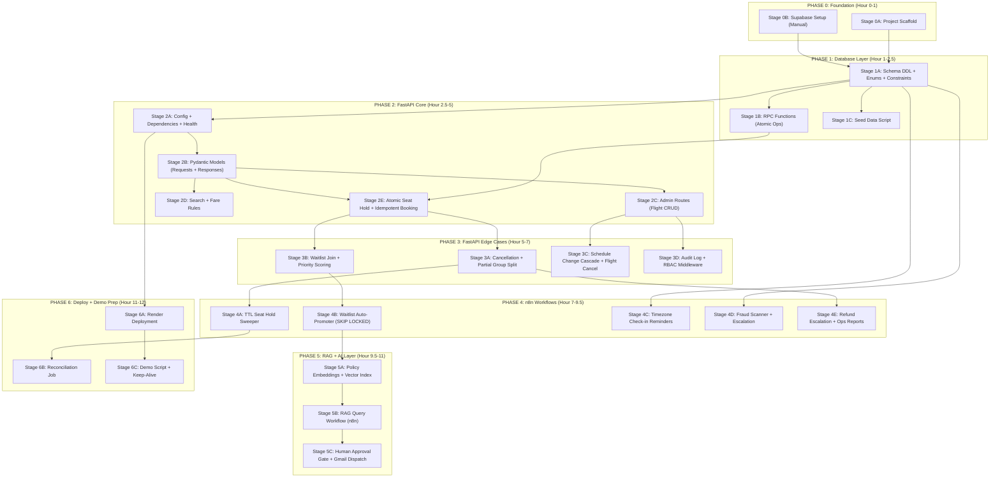

# Execution Strategy: Flight Management System
## Agent-Optimized, Dependency-Aware, 12-Hour Build Plan

> **IMPORTANT:** This document is designed for **agent-driven execution**. Each stage lists exactly what to prompt your agent with, what files it produces, and what must be verified before moving to the next stage. Stages within a phase can run in **parallel** (multiple agent windows). Stages across phases are **sequential** — never skip ahead.

---

## Reference Documents

- [PRD.md](./PRD.md) — Complete Product Requirements (10 domains, 56 features)
- [DATA_FLOW.md](./DATA_FLOW.md) — End-to-End Data Flows, Sequence Diagrams, Postgres DDL
- [project.md](./project.md) — Original feature/edge-case checklist
- [.agents/CONSTRAINTS.md](./.agents/CONSTRAINTS.md) — Hackathon infrastructure rules
- [.agents/PROJECT_MVP.md](./.agents/PROJECT_MVP.md) — MVP spec and 12-hour timeline

---

## Master Dependency Graph



---

## Quick Reference: Parallelism Map

| Time Window | Agent 1 | Agent 2 | Agent 3 | Agent 4 |
| :--- | :--- | :--- | :--- | :--- |
| Hour 0-1 | Stage 0A: Scaffold | **You**: Stage 0B (Supabase) | — | — |
| Hour 1-2 | Stage 1A: Schema DDL | — | — | — |
| Hour 2-2.5 | Stage 1B: RPC Functions | Stage 1C: Seed Data | — | — |
| Hour 2.5-3 | Stage 2A → 2B (sequential) | — | — | — |
| **Hour 3-5** | **Stage 2C: Admin Routes** | **Stage 2D: Search** | **Stage 2E: Booking** | — |
| **Hour 5-7** | **Stage 3A: Cancellations** | **Stage 3B: Waitlist** | **Stage 3C: Schedule Cascade** | **Stage 3D: Audit/RBAC** |
| **Hour 7-9.5** | **Stage 4A: Hold Sweeper** | **Stage 4B: Waitlist Promoter** | **Stage 4C: Reminders** | **Stage 4D+4E: Fraud+Reports** |
| Hour 9.5-10.5 | Stage 5A: Embeddings | — | — | — |
| Hour 10.5-11 | Stage 5B: RAG Workflow | Stage 5C: Approval Gate | — | — |
| Hour 11-12 | Stage 6A: Deploy | Stage 6B: Reconciliation | Stage 6C: Demo Script | — |

> **Maximum parallelism windows:** Hours 3-5 (3 agents), Hours 5-7 (4 agents), Hours 7-9.5 (4 agents). This is where you save the most wall-clock time. Don't run these sequentially.

---

---

## PHASE 0: Project Foundation (Hour 0 → 1)

**Goal:** Empty repo → structured project skeleton + live Supabase project.

---

### Stage 0A: Project Scaffold

| Field | Value |
| :--- | :--- |
| **Parallelizable** | Yes (runs alongside Stage 0B) |
| **Agent Model** | `flash` |
| **Time Budget** | 10 minutes |
| **Depends On** | Nothing |
| **Blocks** | All of Phase 1 and Phase 2 |

#### What to tell the agent:

```
Create the FastAPI project skeleton for a flight management system in `backend/`. Follow this exact structure. Use `uv` for package management. Do NOT use Docker, SQLAlchemy, Celery, or Redis. The stack is FastAPI + Supabase (supabase-py async client) + httpx + Pydantic V2.
```

#### Files the agent must produce:

```
backend/
├── app/
│   ├── __init__.py
│   ├── main.py                 # FastAPI app with lifespan, CORS, exception handler
│   ├── config.py               # Pydantic BaseSettings (all env vars)
│   ├── dependencies.py         # Singleton Supabase client, auth deps, idempotency dep
│   ├── models/
│   │   ├── __init__.py
│   │   ├── requests.py         # (empty, populated in Stage 2B)
│   │   └── responses.py        # (empty, populated in Stage 2B)
│   ├── routes/
│   │   ├── __init__.py
│   │   ├── health.py           # GET /health
│   │   ├── admin.py            # (empty, populated in Stage 2C)
│   │   ├── search.py           # (empty, populated in Stage 2D)
│   │   ├── bookings.py         # (empty, populated in Stage 2E)
│   │   ├── waitlist.py         # (empty, populated in Stage 3B)
│   │   └── webhooks.py         # (empty, populated later)
│   ├── services/
│   │   ├── __init__.py
│   │   ├── flights.py          # (empty, populated in Stage 2C)
│   │   ├── bookings.py         # (empty, populated in Stage 2E)
│   │   └── rag.py              # (empty, populated in Stage 5)
│   └── utils/
│       ├── __init__.py
│       ├── pnr.py              # PNR generator (6-char alphanumeric)
│       └── idempotency.py      # Idempotency key check/store logic
├── tests/
│   ├── __init__.py
│   └── test_health.py          # Smoke test for /health
├── requirements.txt
├── render.yaml
└── .env.example
```

#### Verification gate (must pass before Phase 1):

```bash
cd backend && pip install -r requirements.txt
uvicorn app.main:app --host 0.0.0.0 --port 8000 &
curl http://localhost:8000/health
# Expected: {"status": "healthy", "service": "flight-management-api"}
```

---

### Stage 0B: Supabase Project Setup (MANUAL — You Do This)

| Field | Value |
| :--- | :--- |
| **Parallelizable** | Yes (runs alongside Stage 0A) |
| **Time Budget** | 15 minutes |
| **Depends On** | Nothing |
| **Blocks** | Stage 1A |

> **CAUTION:** This is the ONE manual step. Agents cannot create cloud projects for you.

#### Your checklist:

- [ ] Go to [supabase.com](https://supabase.com) → New Project
- [ ] Name: `flight-management-system`
- [ ] Region: Pick closest to your location
- [ ] Copy and save these 4 values:
  - `SUPABASE_URL` (e.g., `https://xxxx.supabase.co`)
  - `SUPABASE_ANON_KEY`
  - `SUPABASE_SERVICE_ROLE_KEY`
  - Database password (for direct Postgres connection)
- [ ] Enable the `pgvector` extension:
  - Dashboard → Database → Extensions → Search "vector" → Enable
- [ ] Create a `.env` file in `backend/` with the values above
- [ ] Verify connection: Open SQL Editor → Run `SELECT NOW();` → Confirm it returns a timestamp

---

---

## PHASE 1: Database Layer (Hour 1 → 2.5)

**Goal:** All tables, enums, constraints, RPC functions, and seed data live in Supabase.

> **CRITICAL:** This is the **most critical phase**. Every subsequent stage depends on the schema existing. Do NOT start Phase 2 until the SQL has been executed successfully in Supabase.

---

### Stage 1A: Schema DDL — Tables, Enums, Constraints, Indexes

| Field | Value |
| :--- | :--- |
| **Agent Model** | `pro` (complex SQL with edge-case constraints) |
| **Time Budget** | 20 minutes |
| **Depends On** | Stage 0A + Stage 0B |
| **Blocks** | Everything else |

#### What to tell the agent:

```
Write the complete Supabase Postgres migration SQL for our Flight Management System. Reference the DDL in DATA_FLOW.md (the database schema section). Include ALL of these:

1. Custom ENUM types (flight_status, seat_class, seat_status, booking_status, fare_class, waitlist_status)
2. All tables: flights, flight_classes, flight_seats, seat_holds, bookings, passengers, waitlist, refunds, travel_credits, idempotency_records, admin_audit_logs, notification_logs, daily_ops_reports, support_draft_approvals, ops_escalations, price_alert_subscriptions
3. All CHECK constraints from the PRD (capacity sum, positive seats, booked <= capacity, origin != destination, arrival > departure)
4. All UNIQUE constraints (flight_number+origin+date, flight_id+seat_number, flight_id+seat_class)
5. All foreign keys with correct ON DELETE behavior (CASCADE for children, RESTRICT for bookings -> flights)
6. All performance indexes (fraud scan, waitlist priority, seat holds active, bookings lookup)
7. A trigger function that auto-generates PNR codes on booking insert

Output as a single .sql file I can paste into Supabase SQL Editor.
```

#### File produced:

```
supabase/
└── migrations/
    └── 001_complete_schema.sql
```

#### Verification gate:

- [ ] Paste the entire SQL into Supabase SQL Editor
- [ ] Click "Run" — expect zero errors
- [ ] Navigate to Table Editor — verify all tables appear with correct columns and types

---

### Stage 1B: RPC Functions (Atomic Operations)

| Field | Value |
| :--- | :--- |
| **Agent Model** | `pro` |
| **Time Budget** | 15 minutes |
| **Depends On** | Stage 1A |
| **Blocks** | Stage 2E (Atomic Booking) |

#### What to tell the agent:

```
Write Postgres RPC functions (callable via supabase.rpc()) for the following atomic operations. Each must run inside a single transaction. Reference the data flows in DATA_FLOW.md:

1. hold_seat(p_flight_id UUID, p_seat_id UUID, p_session_id TEXT, p_hold_minutes INT)
   — Atomically locks a seat with SELECT FOR UPDATE, checks status is 'AVAILABLE', creates hold row, updates seat status to 'HELD'. Returns hold_id or raises exception.

2. confirm_booking(p_hold_id UUID, p_passenger_name TEXT, p_passenger_email TEXT, p_fare_class fare_class_enum, p_fare_cents INT, p_ip TEXT)
   — Converts a held seat to a confirmed booking: validates hold not expired, creates booking row with auto-PNR, updates seat to 'BOOKED', increments booked_seats counter. Returns booking details or raises exception.

3. cancel_booking(p_booking_id UUID)
   — Releases a booking: calculates refund based on fare_class, creates refund record, decrements booked_seats, sets seat back to 'AVAILABLE'. Returns refund details.

4. promote_waitlist(p_flight_id UUID)
   — Called by n8n. Uses FOR UPDATE SKIP LOCKED to grab the highest priority waitlisted passenger, creates a hold, transitions status to 'PROMOTED'. Returns promoted passenger details or null.

5. sweep_expired_holds()
   — Called by n8n. Finds all holds past their expires_at, releases seats back to 'AVAILABLE', marks holds as 'EXPIRED'. Returns count of released holds.
```

#### File produced:

```
supabase/
└── migrations/
    └── 002_rpc_functions.sql
```

#### Verification gate:

- [ ] Run SQL in Supabase SQL Editor
- [ ] Test: `SELECT hold_seat(...)` with a valid flight/seat → should return a hold_id
- [ ] Test: `SELECT sweep_expired_holds()` → should return 0 (no holds yet)

---

### Stage 1C: Seed Data Script

| Field | Value |
| :--- | :--- |
| **Agent Model** | `flash` |
| **Time Budget** | 10 minutes |
| **Depends On** | Stage 1A |
| **Parallelizable with** | Stage 1B (different files, same database) |

#### What to tell the agent:

```
Write a SQL seed data script for demo purposes. Insert:

1. 3 flights: LHR->DXB (100 seats: 20F/30B/50E), KHI->DXB (80 seats: 10F/20B/50E), JFK->LHR (150 seats: 30F/40B/80E)
2. Physical seat maps for each flight (generate seat numbers like 1A-1F for First, 10A-10F for Business, 20A-30F for Economy)
3. 5 sample bookings across different fare classes (BASIC_ECONOMY, FLEXIBLE, PREMIUM_FIRST) so cancellation logic can be tested
4. 2 waitlist entries with different loyalty tiers (one Platinum, one General) so promotion logic can be tested
5. 1 active seat hold with expires_at = NOW() + INTERVAL '2 minutes' so the sweeper can be tested quickly
6. A sample admin user in Supabase Auth (or just reference by UUID)
```

#### File produced:

```
supabase/
└── seed/
    └── demo_seed.sql
```

#### Verification gate:

- [ ] Run in Supabase SQL Editor
- [ ] Table Editor → `flights` shows 3 rows
- [ ] Table Editor → `bookings` shows 5 rows
- [ ] Table Editor → `waitlist` shows 2 rows

---

---

## PHASE 2: FastAPI Core Endpoints (Hour 2.5 → 5)

**Goal:** All live, transactional API endpoints are functional and testable via curl/Swagger UI.

> **TIP:** Stages 2C, 2D, and 2E can run in **parallel** using 3 separate agent windows, because they write to different files. Stage 2B must complete first since all three depend on the Pydantic models.

---

### Stage 2A: Config, Dependencies, Singleton Client

| Field | Value |
| :--- | :--- |
| **Agent Model** | `flash` |
| **Time Budget** | 10 minutes |
| **Depends On** | Stage 0A + Stage 1A (need Supabase credentials) |
| **Blocks** | Stages 2B-2E |

#### What to tell the agent:

```
Complete backend/app/config.py and backend/app/dependencies.py using the fastapi-pro skill patterns. Include:
- config.py: All env vars (SUPABASE_URL, SUPABASE_ANON_KEY, SUPABASE_SERVICE_ROLE_KEY, OPENAI_API_KEY, CORS_ORIGINS, N8N_WEBHOOK_SECRET)
- dependencies.py: Singleton async Supabase client (get_supabase_client), get_current_user auth dependency, verify_admin_role dependency, idempotency key checker dependency
- main.py: Register CORS middleware with configurable origins, include all routers, add global exception handler, add lifespan event for client warmup
```

#### Verification gate:

```bash
cd backend && python -c "from app.config import settings; print(settings.supabase_url)"
# Should print your Supabase URL without errors
```

---

### Stage 2B: Pydantic V2 Request & Response Models

| Field | Value |
| :--- | :--- |
| **Agent Model** | `flash` |
| **Time Budget** | 15 minutes |
| **Depends On** | Stage 2A |
| **Blocks** | Stages 2C, 2D, 2E (they import these models) |

#### What to tell the agent:

```
Create all Pydantic V2 models in backend/app/models/requests.py and backend/app/models/responses.py. Reference every endpoint in PRD.md. Include:

Request Models:
- FlightCreateRequest (flight_number, origin, destination, departure, arrival, class capacities — with validators: origin != destination, arrival > departure, capacities > 0)
- SeatMapCreateRequest (list of seat assignments with class)
- FlightScheduleUpdateRequest (new departure/arrival times)
- FlightSearchRequest (origin, destination, date, optional class filter)
- SeatHoldRequest (flight_id, seat_id, session_id)
- BookingConfirmRequest (hold_id, passenger_name, email, fare_class, payment_token)
- CancellationRequest (booking_id, passenger_ids for partial cancel)
- WaitlistJoinRequest (flight_id, class, passenger details, loyalty_tier)

Response Models:
- FlightResponse, FlightSearchResult, SeatAvailability
- HoldResponse (hold_id, held_until)
- BookingResponse (pnr, flight, seat, fare, status)
- CancellationResponse (refund_amount, refund_type, updated_status)
- WaitlistResponse (position, priority_score, status)
- ErrorResponse (detail, error_code)

Use Field(...) with min_length, max_length, ge, le validators everywhere. All prices in integer cents.
```

#### Verification gate:

```bash
cd backend && python -c "from app.models.requests import FlightCreateRequest; print('Models OK')"
```

---

### Stage 2C: Admin Routes — Flight CRUD

| Field | Value |
| :--- | :--- |
| **Agent Model** | `pro` |
| **Time Budget** | 20 minutes |
| **Depends On** | Stage 2B |
| **Parallelizable with** | Stages 2D and 2E |
| **Blocks** | Stage 3C, Stage 3D |

#### What to tell the agent:

```
Implement backend/app/routes/admin.py and backend/app/services/flights.py covering PRD Domain 1 (FR-1.1 through FR-1.9). The routes are:

1. POST /api/v1/admin/flights — Create flight with capacity validation (sum check), duplicate detection, auto-generate seat map, write audit log
2. POST /api/v1/admin/flights/{id}/seat-map — Assign physical seat numbers to classes (validate count matches capacity)
3. PATCH /api/v1/admin/flights/{id}/capacity — Adjust class allocation (guard: cannot shrink below booked count)
4. GET /api/v1/admin/flights — List all flights with inventory stats
5. GET /api/v1/admin/flights/{id} — Get single flight with full seat map and booking counts

All routes require verify_admin_role dependency. Every write inserts into admin_audit_logs with previous_state and new_state JSONB. Use the singleton Supabase client.

Reference PRD.md and DATA_FLOW.md for exact edge cases and validation rules.
```

#### Verification gate:

```bash
curl -X POST http://localhost:8000/api/v1/admin/flights \
  -H "Content-Type: application/json" \
  -H "X-Admin-Role: SUPER_ADMIN" \
  -d '{"flight_number":"BA123","origin_airport":"LHR","destination_airport":"DXB","departure_time":"2026-10-01T05:00:00Z","arrival_time":"2026-10-01T12:00:00Z","total_capacity":100,"first_class_seats":20,"business_class_seats":30,"economy_class_seats":50}'
# Expected: 201 Created with flight details
```

---

### Stage 2D: Search & Fare Rules

| Field | Value |
| :--- | :--- |
| **Agent Model** | `flash` |
| **Time Budget** | 15 minutes |
| **Depends On** | Stage 2B |
| **Parallelizable with** | Stages 2C and 2E |

#### What to tell the agent:

```
Implement backend/app/routes/search.py covering PRD Domain 2 (FR-2.1 through FR-2.5):

1. GET /api/v1/flights/search?origin=LHR&destination=DXB&date=2026-10-01&class=ECONOMY — Returns available flights with: available_seats per class = capacity - (booked_seats + active_holds_count), base fare per class, fare class rules description
2. Generate a price_lock_token (HMAC-SHA256 of flight_id + class + price + timestamp, valid 15 minutes) returned with each search result
3. GET /api/v1/flights/{id}/seats — Returns physical seat map with status (AVAILABLE/HELD/BOOKED) per seat

Query must count active holds: SELECT COUNT(*) FROM seat_holds WHERE flight_id=:id AND status='HELD' AND expires_at > NOW()

Reference PRD.md for fare class descriptions and DATA_FLOW.md Flow 2 for the sequence.
```

#### Verification gate:

```bash
curl "http://localhost:8000/api/v1/flights/search?origin=LHR&destination=DXB&date=2026-10-01"
# Expected: JSON array with flights showing available seats per class
```

---

### Stage 2E: Atomic Seat Hold + Idempotent Booking Confirmation

| Field | Value |
| :--- | :--- |
| **Agent Model** | `pro` (highest complexity — race condition prevention) |
| **Time Budget** | 25 minutes |
| **Depends On** | Stage 2B + Stage 1B (RPC functions) |
| **Parallelizable with** | Stages 2C and 2D |

#### What to tell the agent:

```
Implement backend/app/routes/bookings.py and backend/app/services/bookings.py covering PRD Domain 3 (FR-3.1 through FR-3.6):

1. POST /api/v1/bookings/hold — Calls Postgres RPC hold_seat(). Returns hold_id and held_until timestamp. Requires Idempotency-Key header.
2. POST /api/v1/bookings/confirm — Calls Postgres RPC confirm_booking(). Validates price_lock_token hasn't expired. Checks idempotency key. Returns PNR and booking confirmation. Sends booking confirmation email via Gmail (or logs it for now).
3. GET /api/v1/bookings/{pnr} — Lookup booking by PNR.
4. Group booking: if multiple seats requested, ALL must succeed atomically or ALL fail. Loop through hold_seat() calls inside a single RPC transaction.
5. Booking cutoff enforcement: Economy closes 180min before departure, Business/First closes 60min before.

Use the idempotency dependency to check/store keys. Use the Supabase .rpc() method to call the Postgres functions from Stage 1B.

Reference PRD.md Domain 3 and DATA_FLOW.md Flow 3 for the exact sequence.
```

#### Verification gate (CRITICAL — this is the overselling test):

```bash
# Terminal 1: Hold the last seat
curl -X POST http://localhost:8000/api/v1/bookings/hold \
  -H "Idempotency-Key: test-hold-001" \
  -H "Content-Type: application/json" \
  -d '{"flight_id":"<id>","seat_id":"<last-seat-id>","session_id":"session-A"}'

# Terminal 2: Try to hold the SAME seat simultaneously
curl -X POST http://localhost:8000/api/v1/bookings/hold \
  -H "Idempotency-Key: test-hold-002" \
  -H "Content-Type: application/json" \
  -d '{"flight_id":"<id>","seat_id":"<last-seat-id>","session_id":"session-B"}'
# Expected: One returns 201, the other returns 409 Conflict
```

---

---

## PHASE 3: FastAPI Edge Case Endpoints (Hour 5 → 7)

**Goal:** All complex business rules — cancellations, partial splits, schedule cascades, waitlist join, audit trails.

> **TIP:** Stages 3A, 3B, 3C, and 3D can ALL run in **parallel** (4 agent windows) since they write to different route/service files.

---

### Stage 3A: Cancellation + Partial Group Split + Refunds

| Field | Value |
| :--- | :--- |
| **Agent Model** | `pro` |
| **Time Budget** | 20 minutes |
| **Depends On** | Stage 2E |
| **Parallelizable with** | Stages 3B, 3C, 3D |

#### What to tell the agent:

```
Add cancellation endpoints to backend/app/routes/bookings.py and backend/app/services/bookings.py covering PRD Domain 4 (FR-4.1 through FR-4.4):

1. POST /api/v1/bookings/{pnr}/cancel — Full booking cancellation. Fare-type branching:
   - BASIC_ECONOMY -> $0 refund, status = CANCELLED_NO_REFUND
   - FLEXIBLE -> refund = fare_paid - cancellation_fee (10%), status = REFUND_PENDING
   - PREMIUM_FIRST -> refund = fare_paid (100%), status = REFUND_PENDING
   - Releases seat back to AVAILABLE, decrements booked_seats counter

2. POST /api/v1/bookings/{pnr}/cancel-passenger — Partial cancellation. Body: {"passenger_ids": ["P2"]}. Splits passenger into child booking with parent_pnr reference, releases only their seat, proportional refund.

3. POST /api/v1/bookings/{pnr}/travel-credit — Issue travel credit voucher instead of cash refund. Creates record in travel_credits with 365-day expiry.

4. Cancellation calls Postgres RPC cancel_booking() from Stage 1B for atomicity.

Reference PRD.md Domain 4 and DATA_FLOW.md Flow 4.
```

#### Verification gate:

```bash
# Cancel a Basic Economy booking -> expect $0 refund
curl -X POST http://localhost:8000/api/v1/bookings/ABC123/cancel
# Expected: {"refund_amount_cents": 0, "refund_type": "NONE", "status": "CANCELLED_NO_REFUND"}

# Cancel a Flexible booking -> expect partial refund
curl -X POST http://localhost:8000/api/v1/bookings/DEF456/cancel
# Expected: {"refund_amount_cents": 40500, "refund_type": "CASH", "status": "REFUND_PENDING"}
```

---

### Stage 3B: Waitlist Join + Priority Scoring

| Field | Value |
| :--- | :--- |
| **Agent Model** | `flash` |
| **Time Budget** | 15 minutes |
| **Depends On** | Stage 2E |
| **Parallelizable with** | Stages 3A, 3C, 3D |

#### What to tell the agent:

```
Implement backend/app/routes/waitlist.py and backend/app/services/waitlist.py covering PRD Domain 5 (FR-5.1 and FR-5.2):

1. POST /api/v1/flights/{id}/waitlist — Join waitlist when class is full. Validates that the requested class truly has 0 available seats. Computes priority_score = (loyalty_tier_weight * 1000) + (fare_class_weight * 100) - (epoch_hours). Loyalty weights: PLATINUM=3, GOLD=2, SILVER=1, GENERAL=0.
2. GET /api/v1/flights/{id}/waitlist/position?email=x — Check passenger's current position on waitlist.
3. DELETE /api/v1/flights/{id}/waitlist/{id} — Remove self from waitlist.
4. POST /api/v1/waitlist/{id}/claim — Called by a promoted passenger to confirm their seat (converts PROMOTED hold into a booking).

Reference PRD.md Domain 5 for the priority formula and DATA_FLOW.md for the sequence.
```

#### Verification gate:

```bash
curl -X POST http://localhost:8000/api/v1/flights/<id>/waitlist \
  -H "Content-Type: application/json" \
  -d '{"passenger_name":"Test User","passenger_email":"test@example.com","loyalty_tier":"PLATINUM","requested_class":"BUSINESS"}'
# Expected: 201 with priority_score and position
```

---

### Stage 3C: Flight Schedule Change Cascade + Master Cancellation

| Field | Value |
| :--- | :--- |
| **Agent Model** | `pro` |
| **Time Budget** | 15 minutes |
| **Depends On** | Stage 2C |
| **Parallelizable with** | Stages 3A, 3B, 3D |

#### What to tell the agent:

```
Add schedule change and flight cancellation endpoints to backend/app/routes/admin.py covering PRD FR-1.6, FR-1.7, and FR-4.3:

1. PATCH /api/v1/admin/flights/{id}/schedule — Update departure/arrival times. Increments schedule_version. If time shift > 180 minutes, auto-overrides all fare classes to fully refundable. Flags all active bookings with schedule_disrupted = TRUE. Inserts audit log.

2. POST /api/v1/admin/flights/{id}/cancel — Master flight cancellation:
   - Sets flight status to CANCELLED
   - Releases ALL seat holds (bulk update)
   - Cancels ALL waitlist entries
   - Marks ALL bookings as ELIGIBLE_FOR_REBOOKING_OR_REFUND
   - Inserts audit log

3. Both endpoints require SUPER_ADMIN role.

Reference PRD.md FR-1.6, FR-1.7, FR-4.3 and DATA_FLOW.md.
```

#### Verification gate:

```bash
# Reschedule a flight by 4 hours (> 180 min threshold)
curl -X PATCH http://localhost:8000/api/v1/admin/flights/<id>/schedule \
  -H "X-Admin-Role: SUPER_ADMIN" \
  -H "Content-Type: application/json" \
  -d '{"departure_time":"2026-10-01T09:00:00Z","arrival_time":"2026-10-01T16:00:00Z"}'
# Expected: 200 with updated flight, all bookings flagged as disrupted
```

---

### Stage 3D: Audit Log System + RBAC Middleware

| Field | Value |
| :--- | :--- |
| **Agent Model** | `flash` |
| **Time Budget** | 10 minutes |
| **Depends On** | Stage 2C |
| **Parallelizable with** | Stages 3A, 3B, 3C |

#### What to tell the agent:

```
Implement backend/app/utils/audit.py and backend/app/middleware/rbac.py:

1. audit.py: A reusable function log_admin_action(supabase, admin_id, action_type, resource_id, previous_state, new_state, ip_address) that inserts into admin_audit_logs.

2. rbac.py: A FastAPI dependency verify_role(required_role: str) that:
   - Extracts user from JWT via Supabase Auth
   - Checks user.app_metadata.role matches required_role
   - Raises HTTP 403 if insufficient permissions
   - For hackathon MVP, accept a simple X-Admin-Role header as fallback

3. GET /api/v1/admin/audit-logs — Paginated endpoint to view all admin actions with filters by action_type and resource_id.
```

#### Verification gate:

```bash
# Attempt admin action without admin role
curl -X POST http://localhost:8000/api/v1/admin/flights \
  -H "Content-Type: application/json" \
  -d '{...}'
# Expected: 403 Forbidden

# With admin role
curl -X POST http://localhost:8000/api/v1/admin/flights \
  -H "X-Admin-Role: SUPER_ADMIN" \
  -H "Content-Type: application/json" \
  -d '{...}'
# Expected: 201 Created + audit log entry created
```

---

---

## PHASE 4: n8n Cloud Workflows (Hour 7 → 9.5)

**Goal:** All scheduled/background automation workflows built and activated in n8n Cloud.

> **WARNING:** n8n workflows are built in the n8n Cloud UI, NOT in code files. The agent's job here is to produce **detailed workflow blueprints** (node-by-node JSON configs and SQL queries) that you paste into n8n Cloud. You can also use the n8n MCP tools to create these directly.

> **TIP:** Stages 4A through 4E can run in **parallel** — they are independent n8n workflows with no shared state.

---

### Stage 4A: TTL Seat Hold Sweeper

| Field | Value |
| :--- | :--- |
| **Time Budget** | 15 minutes |
| **Depends On** | Stage 3A |
| **n8n Trigger** | Schedule Trigger → Every 60 seconds |
| **Parallelizable with** | Stages 4B, 4C, 4D, 4E |

#### What to tell the agent:

```
Design an n8n workflow for the expired seat hold sweeper. Use the n8n MCP tools if available (create_workflow_from_code). The workflow:

1. Trigger: Schedule node, fires every 60 seconds
2. Postgres Node 1: Execute SQL: SELECT sweep_expired_holds() (calls the RPC from Stage 1B)
3. IF Node: If returned count > 0, proceed to logging
4. Postgres Node 2: Insert notification log: INSERT INTO notification_logs (type, details, created_at) VALUES ('HOLD_SWEEP', json_build_object('released_count', <count>), NOW())

Produce the exact SQL queries, n8n node configuration JSON, and connection details for the Supabase Postgres connection.
```

#### Verification gate:

- [ ] Activate workflow in n8n Cloud
- [ ] Insert an expired hold in Supabase manually
- [ ] Wait 60 seconds → check if hold status changed to `EXPIRED` and seat is `AVAILABLE`

---

### Stage 4B: Waitlist Auto-Promoter (SKIP LOCKED)

| Field | Value |
| :--- | :--- |
| **Time Budget** | 20 minutes |
| **Depends On** | Stage 3B |
| **n8n Trigger** | Schedule Trigger → Every 2 minutes |
| **Parallelizable with** | Stages 4A, 4C, 4D, 4E |

#### What to tell the agent:

```
Design an n8n workflow for waitlist auto-promotion. Use the n8n MCP tools if available.

Main branch — Promotion:
1. Trigger: Schedule, every 2 minutes
2. Postgres Node 1: SELECT promote_waitlist(f.id) FROM flights f JOIN flight_classes fc ON f.id = fc.flight_id WHERE (fc.capacity - fc.booked_seats) > 0 AND EXISTS (SELECT 1 FROM waitlist WHERE flight_id = f.id AND status = 'WAITING') LIMIT 5
3. IF Node: If promotion returned a passenger
4. Gmail Node: Send promotion notification: "A seat has opened up on flight {flight_number}! You have 2 hours to claim it. Click here: [Claim Link]"
5. Postgres Node 2: INSERT INTO notification_logs (booking_id, type, sent_at) VALUES (:id, 'WAITLIST_PROMOTION', NOW())

Second branch — Claim Expiry:
6. Postgres Node 3: UPDATE waitlist SET status = 'EXPIRED_UNCLAIMED' WHERE status = 'PROMOTED' AND claim_deadline < NOW() RETURNING *
7. Gmail Node: Send "Your promotion window has expired" notification to expired passengers
8. Postgres Node 4: Insert notification log

Reference DATA_FLOW.md Flow 5 for the exact sequence.
```

#### Verification gate:

- [ ] Activate workflow in n8n Cloud
- [ ] Cancel a booking in Supabase (freeing a seat on a waitlisted flight)
- [ ] Wait 2 minutes → check if top waitlisted passenger status changed to `PROMOTED`

---

### Stage 4C: Timezone-Aware Check-in Reminders

| Field | Value |
| :--- | :--- |
| **Time Budget** | 15 minutes |
| **Depends On** | Stage 1A |
| **n8n Trigger** | Schedule Trigger → Every hour |
| **Parallelizable with** | Stages 4A, 4B, 4D, 4E |

#### What to tell the agent:

```
Design an n8n workflow for timezone-correct check-in reminders. Use n8n MCP tools if available.

1. Trigger: Schedule, every 1 hour
2. Postgres Node: Run the timezone query from DATA_FLOW.md Flow 6:
   SELECT b.id, b.passenger_email, b.passenger_name, f.flight_number, 
          f.origin_airport, f.destination_airport, f.departure_time, f.origin_tz
   FROM bookings b 
   JOIN flights f ON b.flight_id = f.id
   WHERE f.status NOT IN ('CANCELLED', 'DELAYED')
     AND b.status = 'CONFIRMED'
     AND f.departure_time AT TIME ZONE f.origin_tz 
         BETWEEN (NOW() AT TIME ZONE f.origin_tz + INTERVAL '24 hours')
             AND (NOW() AT TIME ZONE f.origin_tz + INTERVAL '25 hours')
     AND NOT EXISTS (
         SELECT 1 FROM notification_logs 
         WHERE booking_id = b.id AND type = 'CHECKIN_REMINDER'
     )
3. Loop/SplitInBatches: Process each eligible passenger
4. Gmail Node: Send branded check-in reminder with flight details
5. Postgres Insert: INSERT INTO notification_logs (booking_id, type, sent_at) VALUES (:booking_id, 'CHECKIN_REMINDER', NOW())

Key edge case: The WHERE clause filters out cancelled/delayed flights to prevent embarrassing reminders.
```

---

### Stage 4D: Fraud Scanner + Escalation

| Field | Value |
| :--- | :--- |
| **Time Budget** | 15 minutes |
| **Depends On** | Stage 1A |
| **n8n Trigger** | Schedule Trigger → Every 15 minutes |
| **Parallelizable with** | Stages 4A, 4B, 4C, 4E |

#### What to tell the agent:

```
Design an n8n fraud detection workflow. Use n8n MCP tools if available.

1. Trigger: Schedule, every 15 minutes
2. Postgres Node 1: 
   SELECT ip_address, COUNT(*) as cnt 
   FROM bookings 
   WHERE created_at > NOW() - INTERVAL '10 minutes' 
     AND status != 'SUSPECTED_FRAUD' 
   GROUP BY ip_address 
   HAVING COUNT(*) >= 5
3. IF Node: If any suspicious clusters found
4. Postgres Node 2: 
   UPDATE bookings SET status = 'SUSPECTED_FRAUD' 
   WHERE ip_address = :ip AND created_at > NOW() - INTERVAL '10 minutes'
5. Postgres Node 3: 
   INSERT INTO ops_escalations (reason, severity, details, created_at) 
   VALUES ('BOT_BURST_DETECTED', 'HIGH', :details, NOW())
6. Gmail Node: Alert fraud team with IP address, booking count, and booking IDs

Reference DATA_FLOW.md Flow 8.
```

---

### Stage 4E: Refund Escalation + Daily Ops Reports

| Field | Value |
| :--- | :--- |
| **Time Budget** | 15 minutes |
| **Depends On** | Stage 3A |
| **Parallelizable with** | Stages 4A, 4B, 4C, 4D |

#### What to tell the agent:

```
Design TWO n8n workflows. Use n8n MCP tools if available.

WORKFLOW 1: Refund Escalation (Daily at 00:00 UTC)
1. Trigger: Schedule, daily at 00:00
2. Postgres: SELECT * FROM refunds WHERE status = 'PENDING' AND created_at < NOW() - INTERVAL '3 days'
3. IF: Any stuck refunds found
4. Gmail: Alert finance team with refund details (booking PNR, amount, days pending)
5. Postgres: INSERT INTO ops_escalations (reason, severity, details) VALUES ('STUCK_REFUND', 'MEDIUM', :details)

WORKFLOW 2: Daily Ops Report (Daily at 23:59 UTC)
1. Trigger: Schedule, daily at 23:59
2. Postgres Node 1 — Load Factors: 
   SELECT f.flight_number, fc.seat_class, fc.booked_seats, fc.capacity, 
          ROUND(fc.booked_seats::numeric / NULLIF(fc.capacity, 0) * 100, 1) as load_factor_pct 
   FROM flights f JOIN flight_classes fc ON f.id = fc.flight_id 
   WHERE f.departure_time::date = CURRENT_DATE
3. Postgres Node 2 — Revenue: 
   SELECT SUM(fare_paid_cents) / 100.0 as total_revenue, COUNT(*) as booking_count 
   FROM bookings WHERE status = 'CONFIRMED' AND created_at::date = CURRENT_DATE
4. Postgres Insert: INSERT INTO daily_ops_reports (report_date, data, created_at) VALUES (CURRENT_DATE, :json_data, NOW())
5. Gmail: Send executive digest with load factors and revenue summary
```

---

---

## PHASE 5: RAG + AI Layer (Hour 9.5 → 11)

**Goal:** Policy document embeddings stored, vector search functional, RAG drafts generated, human approval gate operational.

---

### Stage 5A: Policy Embeddings + Vector Index

| Field | Value |
| :--- | :--- |
| **Agent Model** | `pro` |
| **Time Budget** | 20 minutes |
| **Depends On** | Phase 4 complete |
| **Blocks** | Stage 5B |

#### What to tell the agent:

```
Create the policy embeddings pipeline:

1. Write 3 sample airline policy documents as markdown files in backend/data/policies/:
   - refund_policy.md — Refund rules per fare class (BASIC_ECONOMY, FLEXIBLE, PREMIUM_FIRST)
   - change_policy.md — Flight change rules, fees, and deadlines per fare class
   - baggage_policy.md — Baggage allowance and fee schedule

2. Write backend/app/services/embeddings.py:
   - Function to chunk markdown into ~500 token segments with overlap
   - Function to embed chunks using OpenAI text-embedding-3-small (dimensions=768)
   - Function to upsert embeddings into Supabase policy_embeddings table (with pgvector)

3. Write the pgvector table DDL and HNSW index as supabase/migrations/003_policy_embeddings.sql:
   CREATE TABLE policy_embeddings (
       id UUID PRIMARY KEY DEFAULT gen_random_uuid(),
       content TEXT NOT NULL,
       fare_class fare_class_enum,
       policy_type VARCHAR(50),
       embedding vector(768),
       metadata JSONB DEFAULT '{}',
       created_at TIMESTAMPTZ DEFAULT NOW()
   );
   CREATE INDEX idx_policy_embedding_hnsw 
   ON policy_embeddings USING hnsw (embedding vector_cosine_ops)
   WITH (m = 16, ef_construction = 64);

4. Write backend/scripts/ingest_policies.py — one-time script to embed and store all policy docs

Reference PRD.md Domain 7 for requirements.
```

#### Verification gate:

```bash
cd backend && python scripts/ingest_policies.py
# Should embed and insert all policy chunks into Supabase

# Verify in Supabase SQL Editor:
SELECT COUNT(*) FROM policy_embeddings;
# Expected: > 0 rows
```

---

### Stage 5B: RAG Query Workflow (n8n)

| Field | Value |
| :--- | :--- |
| **Agent Model** | `pro` |
| **Time Budget** | 20 minutes |
| **Depends On** | Stage 5A |
| **Blocks** | Stage 5C |

#### What to tell the agent:

```
Design the n8n RAG query workflow (DATA_FLOW.md Flow 7). Use n8n MCP tools if available.

1. Webhook Trigger: Receives POST {"pnr": "ABC123", "question": "Can I get a refund?"}
2. Postgres Node: Look up booking: SELECT fare_class, fare_paid_cents, passenger_name, passenger_email FROM bookings WHERE pnr = :pnr
3. HTTP Request Node: Call OpenAI embeddings API to embed the question (model: text-embedding-3-small, dimensions: 768)
4. Postgres Node: Vector similarity search with fare class filter:
   SELECT content, 1 - (embedding <=> :query_embedding::vector) as similarity 
   FROM policy_embeddings 
   WHERE fare_class = :fare_class OR fare_class IS NULL
   ORDER BY embedding <=> :query_embedding::vector 
   LIMIT 3
5. HTTP Request Node: Call OpenAI Chat API with system prompt:
   "You are a customer service assistant. Answer ONLY based on the provided policy context. The customer has a {fare_class} ticket. Context: {retrieved_chunks}. Question: {question}"
6. Postgres Node: INSERT INTO support_draft_approvals (pnr, customer_email, inquiry_text, retrieved_policy_snippet, draft_response, status) VALUES (:pnr, :email, :question, :context, :draft, 'PENDING')
7. Respond to Webhook: Return {"status": "draft_created", "draft_id": ...}

Reference DATA_FLOW.md Flow 7 for the complete sequence.
```

#### Verification gate:

```bash
curl -X POST https://your-n8n-instance.app.n8n.cloud/webhook/rag-query \
  -H "Content-Type: application/json" \
  -d '{"pnr": "ABC123", "question": "Can I get a refund if I cancel today?"}'
# Expected: {"status": "draft_created", "draft_id": "..."}
# Check support_draft_approvals table in Supabase — should have a PENDING row
```

---

### Stage 5C: Human Approval Gate + Gmail Dispatch

| Field | Value |
| :--- | :--- |
| **Agent Model** | `flash` |
| **Time Budget** | 15 minutes |
| **Depends On** | Stage 5B |

#### What to tell the agent:

```
Design the n8n human approval gate workflow. Use n8n MCP tools if available.

WORKFLOW 1: Notification to Ops Agent (triggered by Stage 5B completion)
1. Triggered after Stage 5B inserts a PENDING draft
2. Postgres: SELECT * FROM support_draft_approvals WHERE status = 'PENDING' ORDER BY created_at DESC LIMIT 1
3. Gmail Node: Send to ops agent email with:
   - Customer inquiry text
   - Booking PNR and fare class
   - AI-drafted response
   - Two action links:
     - [Approve & Send]: https://your-n8n.app.n8n.cloud/webhook/approve-draft?id={draft_id}&action=approve
     - [Reject]: https://your-n8n.app.n8n.cloud/webhook/approve-draft?id={draft_id}&action=reject

WORKFLOW 2: Approval Action Handler
1. Webhook Trigger: GET /webhook/approve-draft?id={draft_id}&action={approve|reject}
2. IF Node: Branch on action parameter
3. Approve branch:
   - Postgres: UPDATE support_draft_approvals SET status = 'APPROVED', reviewer_id = 'ops-agent' WHERE id = :draft_id RETURNING *
   - Gmail: Send the draft_response to customer_email
   - Postgres: INSERT INTO notification_logs (type, details) VALUES ('RAG_RESPONSE_SENT', ...)
4. Reject branch:
   - Postgres: UPDATE support_draft_approvals SET status = 'REJECTED', reviewer_id = 'ops-agent' WHERE id = :draft_id
```

#### Verification gate:

- [ ] Submit a RAG query (Stage 5B webhook)
- [ ] Check ops agent email → should receive draft with Approve/Reject links
- [ ] Click Approve → check customer email → should receive the approved response
- [ ] Check `support_draft_approvals` table → status should be `APPROVED`

---

---

## PHASE 6: Deploy + Demo Prep (Hour 11 → 12)

**Goal:** Everything deployed, tested end-to-end, demo script rehearsed.

---

### Stage 6A: Render Deployment

| Field | Value |
| :--- | :--- |
| **Agent Model** | `flash` |
| **Time Budget** | 15 minutes |
| **Depends On** | Stage 2A (needs working FastAPI app) |

#### What to tell the agent:

```
Prepare Render deployment:
1. Verify backend/render.yaml has correct startCommand: uvicorn app.main:app --host 0.0.0.0 --port $PORT
2. Verify backend/requirements.txt includes ALL dependencies (fastapi, uvicorn, supabase, httpx, pydantic-settings, openai, python-multipart)
3. Create backend/Procfile as fallback: web: uvicorn app.main:app --host 0.0.0.0 --port $PORT
4. List all required environment variables for the Render dashboard
5. Ensure .gitignore excludes .env but not .env.example
```

#### Your manual steps:

- [ ] Push code to GitHub
- [ ] Render Dashboard → New Web Service → Connect GitHub repo → Select `backend/` as root
- [ ] Set ALL environment variables in Render dashboard:
  - `SUPABASE_URL`
  - `SUPABASE_ANON_KEY`
  - `SUPABASE_SERVICE_ROLE_KEY`
  - `OPENAI_API_KEY`
  - `CORS_ORIGINS` (set to your Vercel frontend URL)
  - `N8N_WEBHOOK_SECRET`
- [ ] Deploy → Wait for build → Test: `curl https://your-app.onrender.com/health`

---

### Stage 6B: Nightly Reconciliation Job

| Field | Value |
| :--- | :--- |
| **Agent Model** | `flash` |
| **Time Budget** | 10 minutes |
| **Depends On** | Stage 4A |

#### What to tell the agent:

```
Design the n8n nightly reconciliation workflow (DATA_FLOW.md Flow 9). Use n8n MCP tools if available.

1. Trigger: Schedule, daily at 03:00 UTC
2. Step 1 — Reclaim orphaned holds: SELECT sweep_expired_holds() (RPC from Stage 1B)
3. Step 2 — Invariant balance check:
   SELECT f.id as flight_id, fc.seat_class, fc.booked_seats as recorded_booked,
          COUNT(s.id) FILTER (WHERE s.status = 'BOOKED') as actual_booked
   FROM flights f 
   JOIN flight_classes fc ON f.id = fc.flight_id
   LEFT JOIN flight_seats s ON f.id = s.flight_id AND fc.seat_class = s.seat_class
   GROUP BY f.id, fc.seat_class, fc.booked_seats
   HAVING fc.booked_seats != COUNT(s.id) FILTER (WHERE s.status = 'BOOKED')
4. IF mismatch found: Gmail alert to ops team with flight IDs and discrepancy details
5. Always: INSERT INTO admin_audit_logs (action_type, details) VALUES ('RECONCILIATION_RUN', ...)
```

---

### Stage 6C: Demo Script + Keep-Alive Ping

| Field | Value |
| :--- | :--- |
| **Agent Model** | `flash` |
| **Time Budget** | 15 minutes |
| **Depends On** | Stage 6A |

#### What to tell the agent:

```
Create two final deliverables:

1. n8n Keep-Alive Workflow:
   - Schedule trigger: every 14 minutes
   - HTTP Request node: GET https://your-app.onrender.com/health
   - Prevents Render free-tier cold start during demo

2. DEMO_SCRIPT.md file in the project root with a step-by-step click sequence:
   - Step 1: Show flight creation (Admin creates LHR->DXB with 100 seats)
   - Step 2: Show search (Passenger searches flights, sees live availability)
   - Step 3: Show atomic booking (Hold seat -> Confirm -> Show PNR)
   - Step 4: Show overselling prevention (Try booking same seat -> 409 Conflict)
   - Step 5: Show idempotency (Resend same booking request -> returns cached response)
   - Step 6: Show cancellation branching (Cancel Basic Economy -> $0, Cancel Flexible -> partial refund)
   - Step 7: Show waitlist auto-promotion (Cancel a seat -> n8n promotes waitlisted passenger -> email sent)
   - Step 8: Show RAG query (Ask policy question -> draft generated -> human approves -> email dispatched)
   - Step 9: Show fraud detection (Mass-book 5 tickets from same IP -> n8n flags them as SUSPECTED_FRAUD)
   - Step 10: Show audit log (Display all admin actions with timestamps and previous/new state)

Include the exact curl commands or API calls for each step.
```

---

---

## Emergency Scope Cut List

If you fall behind schedule, cut these features in this exact order (least demo impact first):

| Priority | Feature to Cut | Impact | Replacement |
| :--- | :--- | :--- | :--- |
| Cut 1st | FR-6.3 Price-drop alerts | Zero demo impact | Skip entirely |
| Cut 2nd | FR-7.5 Historical fraud audit | Zero demo impact | Skip entirely |
| Cut 3rd | FR-4.2 Partial group cancellation | Low demo impact | Only support full cancellation |
| Cut 4th | FR-1.4 Physical seat map | Low demo impact | Auto-generate generic seat numbers |
| Cut 5th | FR-2.4 Multi-leg itineraries | Medium demo impact | Single-leg flights only |
| Cut 6th | FR-4.4 Travel credit vouchers | Medium demo impact | Cash refund only |
| Cut 7th | FR-6.4 Daily ops reports | Medium demo impact | Skip — show raw SQL in Supabase |
| Cut 8th | FR-1.8 RBAC tiers | Medium demo impact | Single admin role only |
| **NEVER Cut** | **Atomic booking (FR-3.2)** | **Demo killer** | — |
| **NEVER Cut** | **Waitlist promotion (FR-5.3)** | **Demo killer** | — |
| **NEVER Cut** | **RAG + Human gate (FR-7.1-7.2)** | **Demo killer** | — |
| **NEVER Cut** | **Fraud detection (FR-7.3)** | **Demo killer** | — |

---

## Context Files for New Threads

When starting a new agent thread to execute any stage, **always include these context files** in your prompt or reference:

1. **This file** — `EXECUTION_STRATEGY.md` (for the specific stage instructions)
2. **`PRD.md`** — For detailed feature requirements and edge cases
3. **`DATA_FLOW.md`** — For sequence diagrams, SQL queries, and schema DDL
4. **`project.md`** — For the original feature checklist and ownership tags
5. **`.agents/CONSTRAINTS.md`** — For infrastructure rules (no Docker, no local n8n)
6. **`.agents/skills/fastapi-pro/SKILL.md`** — For FastAPI coding patterns and templates
7. **`.agents/skills/hackathon-critic/SKILL.md`** — For architecture review vectors

---

## Stage Completion Tracker

Use this checklist to track progress across threads:

### Phase 0: Foundation
- [ ] Stage 0A: Project Scaffold — `backend/` structure created, `/health` responds
- [ ] Stage 0B: Supabase Setup — Project created, pgvector enabled, credentials saved

### Phase 1: Database
- [ ] Stage 1A: Schema DDL — All tables, enums, constraints created in Supabase
- [ ] Stage 1B: RPC Functions — All 5 atomic functions created and tested
- [ ] Stage 1C: Seed Data — Demo data inserted (3 flights, 5 bookings, 2 waitlist)

### Phase 2: FastAPI Core
- [ ] Stage 2A: Config + Dependencies — Settings, singleton client, auth deps working
- [ ] Stage 2B: Pydantic Models — All request/response models created with validators
- [ ] Stage 2C: Admin Routes — Flight CRUD endpoints working with audit logs
- [ ] Stage 2D: Search Routes — Flight search with availability counts and price lock tokens
- [ ] Stage 2E: Booking Routes — Atomic hold + idempotent confirm + oversell prevention verified

### Phase 3: Edge Cases
- [ ] Stage 3A: Cancellations — Fare-type branching + partial group split + refunds
- [ ] Stage 3B: Waitlist — Join + priority scoring + position check + claim
- [ ] Stage 3C: Schedule Cascade — Time change cascade + master flight cancellation
- [ ] Stage 3D: Audit + RBAC — Audit logger utility + role verification middleware

### Phase 4: n8n Workflows
- [ ] Stage 4A: Hold Sweeper — Runs every 60s, releases expired holds
- [ ] Stage 4B: Waitlist Promoter — Runs every 2m, promotes with SKIP LOCKED
- [ ] Stage 4C: Check-in Reminders — Runs hourly, timezone-aware, suppresses cancelled
- [ ] Stage 4D: Fraud Scanner — Runs every 15m, flags burst bookings
- [ ] Stage 4E: Refund Escalation + Ops Reports — Daily crons working

### Phase 5: RAG + AI
- [ ] Stage 5A: Policy Embeddings — Docs chunked, embedded, indexed in pgvector
- [ ] Stage 5B: RAG Query — n8n webhook receives question, drafts response
- [ ] Stage 5C: Approval Gate — Ops agent receives email, approve/reject works

### Phase 6: Deploy + Demo
- [ ] Stage 6A: Render Deployment — FastAPI live on Render, /health responds
- [ ] Stage 6B: Reconciliation — Nightly integrity check workflow active
- [ ] Stage 6C: Demo Script — Keep-alive ping active, DEMO_SCRIPT.md written and rehearsed
