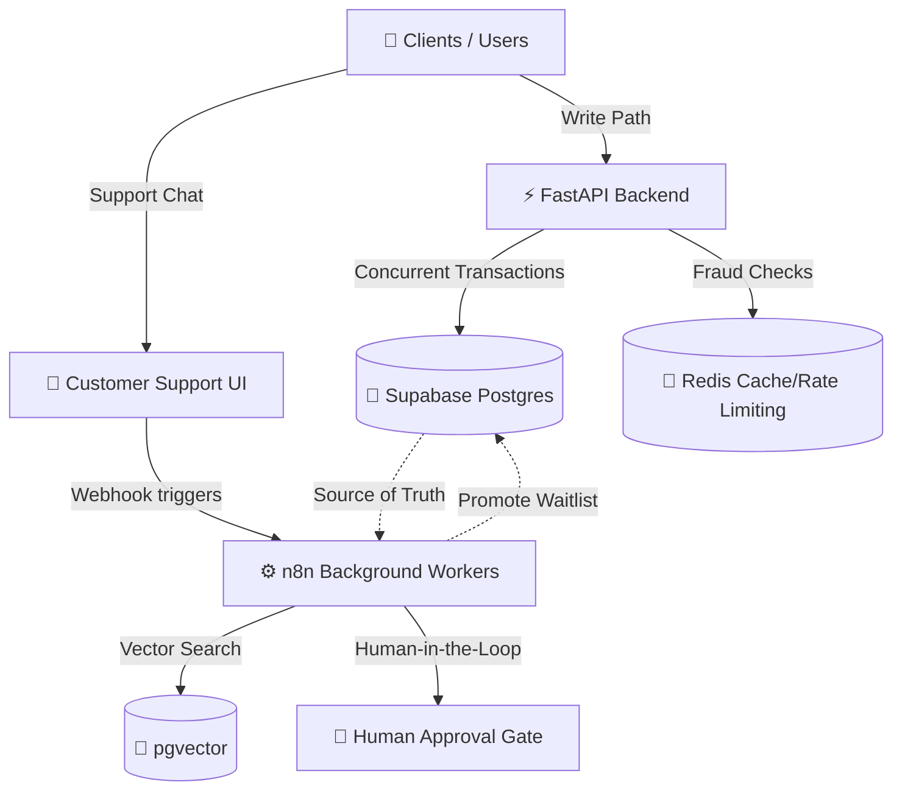

# ✈️ Autonomous Flight Management System


An advanced, highly concurrent flight booking and management system designed to eliminate overbooking, handle massive burst traffic (e.g., bot attacks, flash sales), and provide intelligent customer support with human-in-the-loop safeguards.

## 🎯 Problem & Solution Overview

Airlines face massive challenges with high-concurrency booking events, often leading to oversold flights and frustrated customers. Additionally, automated bot attacks hoard inventory, while customer support agents are overwhelmed during peak times.

**Our Solution:** A dual-writer architecture that completely prevents overselling using advanced Postgres locking mechanisms. We've built an automated waitlist promotion system, real-time bot fraud detection, and an AI-powered customer support bot that leverages zero-hallucination RAG with a mandatory human approval gate for critical actions.

## 🏗️ Architecture



## ✨ Key Technical Highlights

- **Concurrency & Race Condition Prevention**: Utilizes robust Postgres row locks (`SELECT ... FOR UPDATE`) to guarantee absolute data consistency, preventing any possibility of overselling seats.
- **Automated Waitlist Promotion**: Implements efficient queue management using `SELECT ... FOR UPDATE SKIP LOCKED` to instantly and safely promote waitlisted passengers when seats become available.
- **Zero-Hallucination RAG Support**: AI support agent powered by vector search (pgvector), strictly constrained to verified context, featuring a mandatory **Human Approval Gate** for sensitive operations (like refunds or rebookings).
- **Real-Time Bot & Burst Fraud Detection**: Specialized middleware and background workers designed to identify and mitigate automated scalper bots and sudden traffic spikes.

## 🤖 AI Integration: Google AI Studio

Our platform leverages **Google AI Studio** APIs to power its intelligent customer support and policy retrieval systems. By integrating advanced Gemini models, we achieve fast, accurate, and context-aware interactions.

### Models Running

1. **Gemini 2.0 Flash (`gemini-2.0-flash`)**
   - **Role:** Core Generative AI Engine for Customer Support.
   - **Details:** Chosen for its blazing-fast inference speed and advanced reasoning capabilities. Gemini 2.0 Flash takes the user's question, their PNR context, and the retrieved policy chunks (RAG) to draft highly accurate, grounded responses. It powers the zero-hallucination constraint by strictly adhering to the provided context.
2. **Text Embedding (`text-embedding-004`)**
   - **Role:** Vector Representation Engine.
   - **Details:** Used to process and embed all complex airline policies, fare rules, and baggage limits into high-dimensional vectors. These embeddings are stored in our Supabase `pgvector` database to enable semantic similarity searches when a user asks a question.

### How it Works (The AI Workflow)
- **Ingestion:** Airline policies are embedded via Google's text-embedding model and saved in pgvector.
- **Retrieval (RAG):** When a passenger submits an inquiry (e.g., "What is the cancellation fee for Basic Economy?"), their query is embedded and matched against the closest policy chunks in the database.
- **Generation:** The retrieved context and the passenger's inquiry are sent to **Gemini 2.0 Flash** via the Google AI Studio API. 
- **Human-in-the-Loop:** Gemini formulates a draft response, which is then sent to a secure Operations Dashboard (Human Approval Gate). A human agent reviews the Gemini-generated draft and clicks "Approve & Send" or "Reject", guaranteeing 100% accuracy and preventing rogue AI behavior.

## 📁 Project Structure

```text
📦 repository-root
 ┣ 📂 backend/         # FastAPI application, API endpoints, Pydantic models, and DB sessions
 ┣ 📂 supabase/        # Database schemas, migrations, pgvector setup, and seed data
 ┣ 📂 n8n/             # Background workflows, AI agent definitions, and automation logic
 ┣ 📜 README.md        # This file
 ┗ 📜 .gitignore       # Git ignore rules ensuring secrets stay safe
```

## 🚀 Live Demo Quickstart

Judges, please proceed to our demo script for step-by-step verification commands to see the system in action under heavy load!

👉 **[Go to the DEMO SCRIPT](DEMO_SCRIPT.md)** 👈
