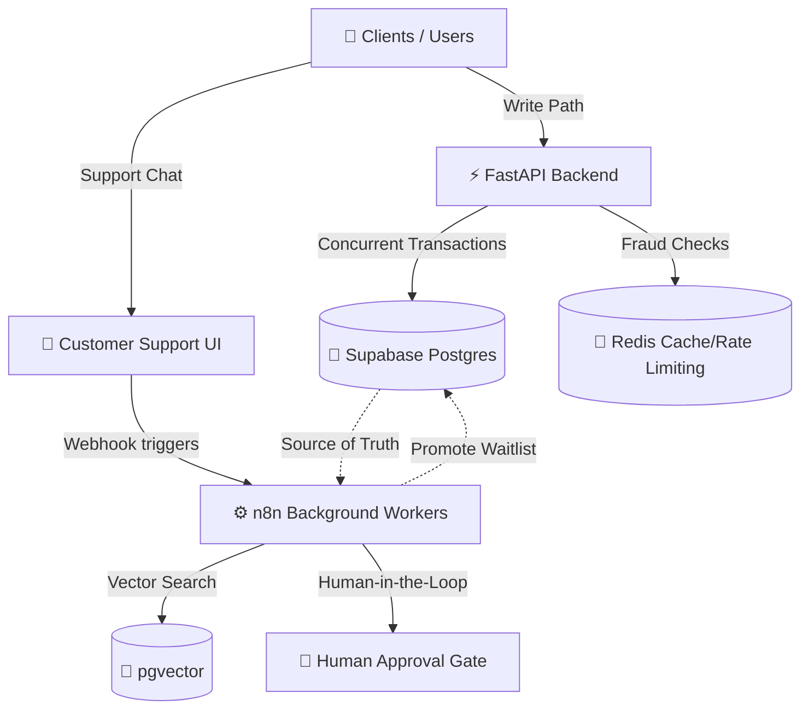

# ✈️ Autonomous Flight Management System


An advanced, highly concurrent flight booking and management system designed to eliminate overbooking, handle massive burst traffic (e.g., bot attacks, flash sales), and provide intelligent customer support with human-in-the-loop safeguards.

## 🎯 Problem & Solution Overview

Airlines face massive challenges with high-concurrency booking events, often leading to oversold flights and frustrated customers. Additionally, automated bot attacks hoard inventory, while customer support agents are overwhelmed during peak times.

**Our Solution:** A dual-writer architecture that completely prevents overselling using advanced Postgres locking mechanisms. We've built an automated waitlist promotion system, real-time bot fraud detection, and an AI-powered customer support bot that leverages zero-hallucination RAG with a mandatory human approval gate for critical actions.

## 🏗️ Architecture



## ✨ Key Technical Highlights

- **Concurrency & Race Condition Prevention**: Utilizes robust Postgres row locks (`SELECT ... FOR UPDATE`) to guarantee absolute data consistency, preventing any possibility of overselling seats.
- **Automated Waitlist Promotion**: Implements efficient queue management using `SELECT ... FOR UPDATE SKIP LOCKED` to instantly and safely promote waitlisted passengers when seats become available.
- **Zero-Hallucination RAG Support**: AI support agent powered by vector search (pgvector), strictly constrained to verified context, featuring a mandatory **Human Approval Gate** for sensitive operations (like refunds or rebookings).
- **Real-Time Bot & Burst Fraud Detection**: Specialized middleware and background workers designed to identify and mitigate automated scalper bots and sudden traffic spikes.

## 📁 Project Structure

```text
📦 repository-root
 ┣ 📂 backend/         # FastAPI application, API endpoints, Pydantic models, and DB sessions
 ┣ 📂 supabase/        # Database schemas, migrations, pgvector setup, and seed data
 ┣ 📂 n8n/             # Background workflows, AI agent definitions, and automation logic
 ┣ 📜 README.md        # This file
 ┗ 📜 .gitignore       # Git ignore rules ensuring secrets stay safe
```

## 🚀 Live Demo Quickstart

Judges, please proceed to our demo script for step-by-step verification commands to see the system in action under heavy load!

👉 **[Go to the DEMO SCRIPT](DEMO_SCRIPT.md)** 👈
